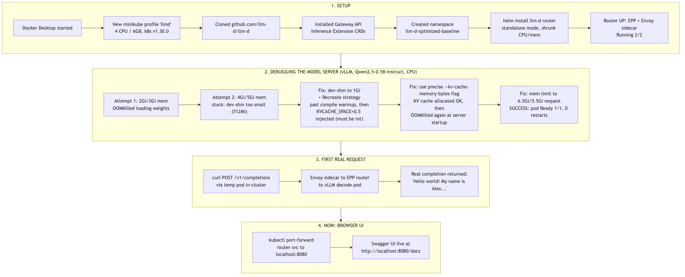

# llm-d local training/demo

Overlay files used to run [llm-d](https://github.com/llm-d/llm-d) (the "optimized-baseline"
guide) on a resource-constrained local minikube cluster, instead of the upstream default
of 16 GPUs / a 32B model.

Deploys a tiny, ungated model (`Qwen/Qwen2.5-0.5B-Instruct`) on CPU behind the real
llm-d router (Envoy sidecar + EPP endpoint-picker), so the full request path —
`client -> Envoy -> EPP -> vLLM` — works end to end on a laptop, without any GPUs or a
HuggingFace token.

## Layout

These files mirror their location inside an `llm-d` checkout:

- `guides/optimized-baseline/modelserver/cpu/vllm-demo/` — kustomize overlay on top of
  the upstream `cpu/vllm` guide. Swaps in the small model, shrinks CPU/memory to fit a
  4 CPU / 6GB node, uses the `Recreate` deployment strategy (a `RollingUpdate` can
  deadlock on a single-node cluster that can't fit two copies of the pod at once), and
  fixes a couple of CPU-backend-specific resource quirks (see below).
- `guides/optimized-baseline/router/demo.values.yaml` — Helm values override that
  shrinks the router chart's default EPP/Envoy sidecar resource requests (4 CPU/8Gi each
  by default) down to something a small cluster can schedule.
- [`rag-demo/`](rag-demo/README.md) — minimal RAG (Retrieval-Augmented Generation) example
  that queries the model deployed above: embed docs -> FAISS search -> vLLM (via the
  llm-d router) generates the answer. Also has a glossary of core LLM concepts.

## Usage

1. Clone `llm-d/llm-d` and follow the
   [optimized-baseline guide](https://github.com/llm-d/llm-d/blob/main/guides/optimized-baseline/README.md)
   prerequisites (CRDs, namespace) up through "Deploy the llm-d Router", passing this
   repo's `demo.values.yaml` as an extra `-f` to the `helm install` command.
2. Copy `guides/optimized-baseline/modelserver/cpu/vllm-demo/` into your llm-d checkout
   at the same path.
3. `kubectl apply -n <namespace> -k guides/optimized-baseline/modelserver/cpu/vllm-demo/`

## Notes from getting this working on Apple Silicon (Docker Desktop / minikube)

- The vLLM CPU backend upcasts to float32 regardless of `--dtype`, since there's no
  AVX-512-BF16 on this hardware — budget roughly 2x the model's stated size in memory.
- `/dev/shm` (used for vLLM's internal shared-memory IPC between its worker processes)
  needs to be sized generously — 512Mi was too small and caused a silent stall at the
  "warming up model for compilation" step. 1Gi worked.
- `VLLM_CPU_KVCACHE_SPACE` only accepts whole-GiB integers; use the byte-precise
  `--kv-cache-memory-bytes` CLI flag instead for fine-grained control on a small cluster.
- Its "available memory" check reads host-wide free RAM (via `/proc/meminfo`), not the
  container's own cgroup limit — so it can report a confusingly large total. The
  container's actual memory *limit* is still enforced by the kernel and is what
  determines whether you get OOMKilled; size it generously (this repo settled on
  5.5Gi request / 6.5Gi limit for a 0.5B model at `--max_model_len=2048`).

